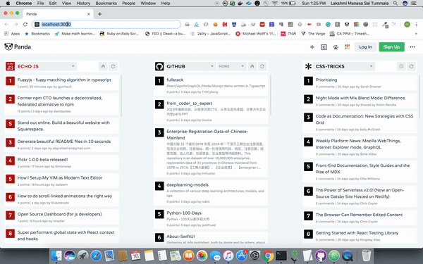

This project was bootstrapped with [Create React App](https://github.com/facebook/create-react-app).

### Quiz-ReactJS
A Quiz app with Raect JS and React Router

### Run

In the project directory, you can run **npm start**

Runs the app in the development mode. 
Open [http://localhost:3000](http://localhost:3000) to view it in the browser.

The page will reload if you make edits. 
You will also see any lint errors in the console.

### App functionality

- In this application we start a quiz with set of **predefined questions**.
- Once the questions are answered we display the score along with the result of each question.
- In the same page we provide option to **retake the quiz** or **add a new question**.
- If user choses to add a new question, we provide a form to add the question and the four options along with the correct answer. On submit, we store the new question in the **localstorage** of the browser. Next time the quiz is taken, we display this new question along with the other questions.

### Demo

